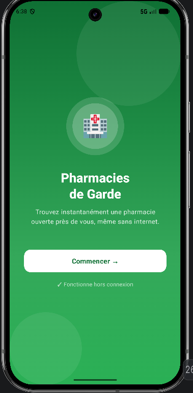
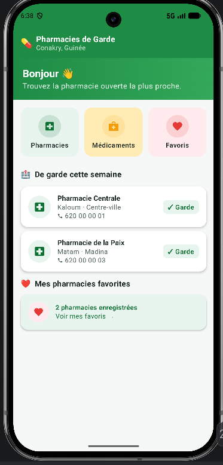
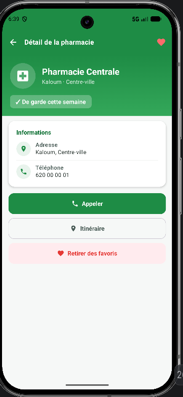
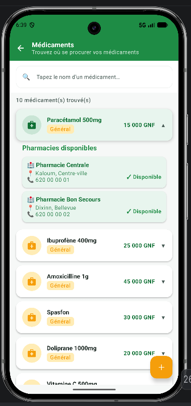

# 🏥 Pharmacies de Garde - Conakry

> **Projet Fil Rouge** - Formation en Développement Mobile (Kotlin) - Orange Digital Center

Application Android (MVP) conçue pour aider les utilisateurs à trouver rapidement une pharmacie de garde ou un médicament précis à Conakry, même sans connexion internet (Offline-first).

## 📱 Captures d'écran


| Accueil & Tableau de bord | Liste des Pharmacies | Détail Pharmacie | Recherche Médicaments |
| :---: | :---: | :---: | :---: |
|  |  |  |  |

## ✨ Fonctionnalités Principales

*   **Offline-First** : Fonctionne 100% sans connexion internet. Les données sont stockées localement.
*   **Tableau de bord** : Accès rapide aux pharmacies de garde de la semaine et aux favoris.
*   **Liste des pharmacies** : Filtres par commune et affichage clair des pharmacies de garde.
*   **Fiche détaillée** : Coordonnées, bouton d'appel direct, itinéraire (GPS ou Google Maps) et ajout aux favoris.
*   **Recherche de médicaments** : Trouvez rapidement quelles pharmacies disposent du médicament recherché.
*   **Favoris** : Sauvegardez vos pharmacies habituelles pour un accès rapide.
*   **Interface Premium** : Design moderne "glassmorphism", mode sombre/clair, montants formatés en GNF.

## 🛠 Architecture & Technologies

L'application respecte strictement l'architecture **MVVM** (Model-View-ViewModel) et utilise les technologies modernes d'Android :

*   **Langage** : Kotlin
*   **Interface Utilisateur** : Jetpack Compose (Material Design 3)
*   **Base de données locale** : Room Database (v3 avec migrations)
*   **Architecture** : MVVM (DAO → Repository → ViewModel → UI)
*   **Asynchronisme & Flux de données** : Coroutines & StateFlow
*   **Navigation** : Navigation Compose

## 🗄 Modèle de Données (Room)

*   `Pharmacie` : id, nom, commune, quartier, téléphone, latitude, longitude, estDeGarde, debutGarde, finGarde
*   `Medicament` : id, nom, categorie, description, prix
*   `Stock` : pharmacieId, medicamentId, disponible
*   `Favori` : pharmacieId

## 🚀 Installation & Lancement

### Prérequis
*   Android Studio (Iguana ou supérieur recommandé)
*   Un appareil Android (physique ou émulateur) sous Android 8.0 (API 26) ou supérieur.

### Étapes
1.  Clonez ce dépôt Git :
    ```bash
    git clone https://github.com/Thierno-webdev/PharmaciesDeGardes.git
    ```
2.  Ouvrez le projet dans Android Studio.
3.  Laissez Gradle synchroniser les dépendances.
4.  Cliquez sur le bouton **Run 'app'** (Maj + F10) pour compiler et lancer l'application sur votre émulateur ou appareil connecté.

*Note : L'application est pré-chargée avec des données de démonstration (10 pharmacies, 18 médicaments, stocks simulés) grâce à un script `DatabaseSeeder`.*

## 👥 Équipe de Développement

*(À compléter avec vos prénoms/noms selon vos rôles)*

*   **Chef de projet & intégration** : Mabinty Fofana
*   **Responsable données (Room)** : Antony Guotsop Nguessong
*   **Responsable interface (Pharmacies)** : Mamadou Saliou Diallo
*   **Responsable logique médicaments** : Mohammadou Mouctar Diallo
*   **Responsable Dashboard & Favoris** : Thierno Abdoulaye Diakité

---
*Réalisé dans le cadre de la formation Orange Digital Center Guinée - 2026.*
